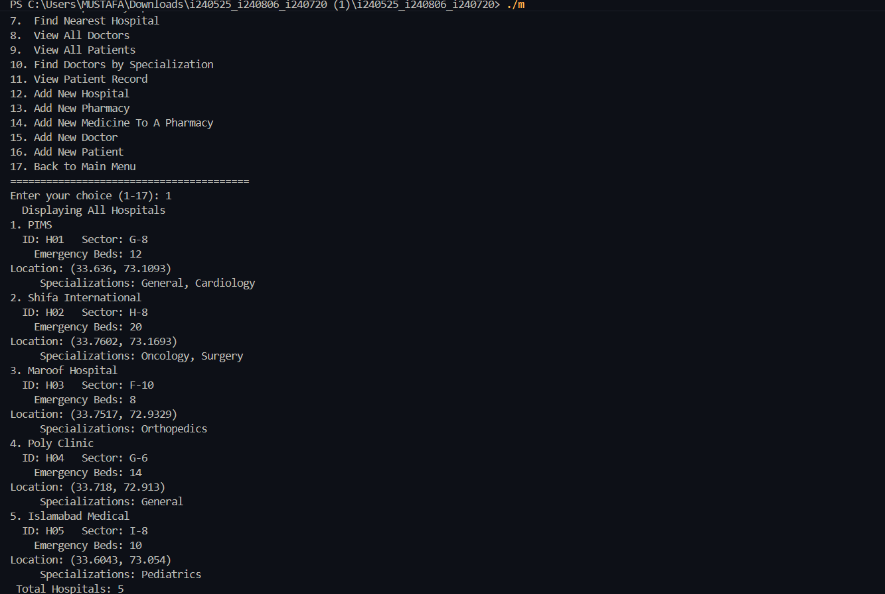
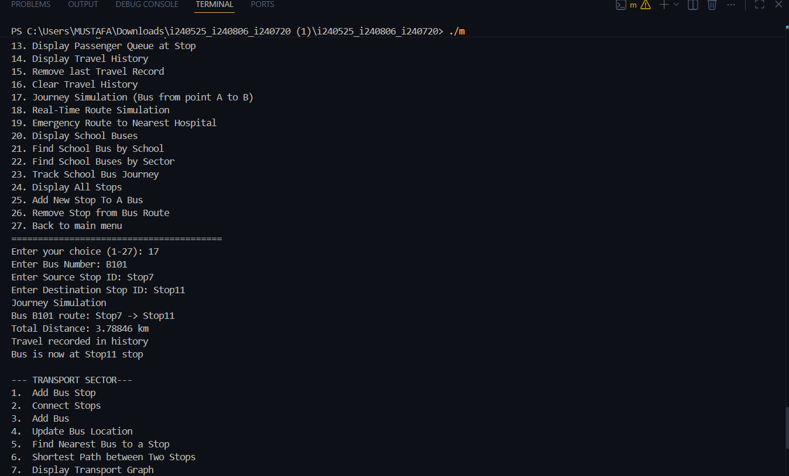
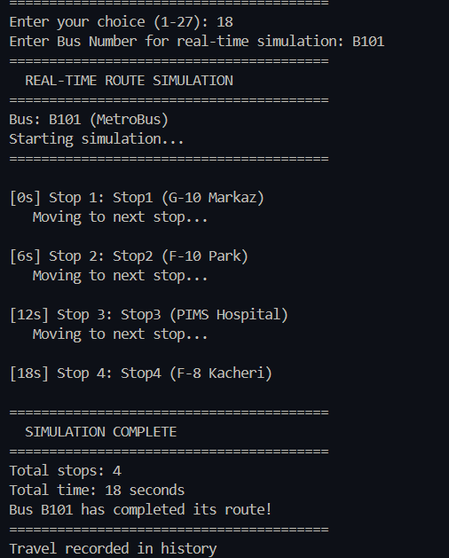
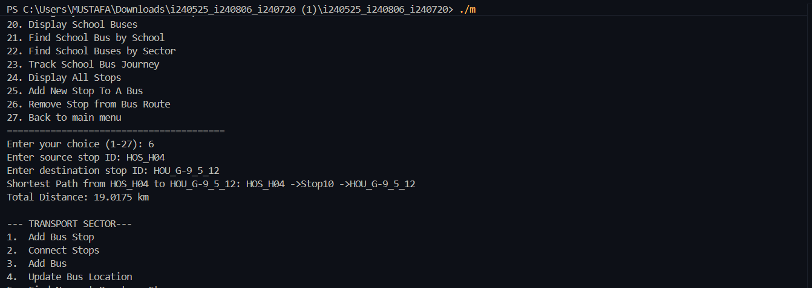

# SmartCity Islamabad — Data Structures Urban Simulation

A console-based C++ simulation of a smart city management system modeled on Islamabad, Pakistan. The project demonstrates core data structures (graphs, hash tables, heaps, linked lists, queues, stacks) applied to real urban-management scenarios across eight city sectors.

---

## Table of Contents

- [Overview](#overview)
- [Data Structures Used](#data-structures-used)
- [City Sectors](#city-sectors)
- [Project Structure](#project-structure)
- [Getting Started](#getting-started)
- [Data Files](#data-files)
- [Authors](#authors)

---

## Overview

The system models Islamabad as a unified graph where every entity — hospitals, schools, bus stops, houses, airports, railway stations, malls, and public facilities — is a node with GPS coordinates. Sectors share a single city-wide graph so that cross-sector operations (e.g., routing an emergency vehicle from a bus stop to the nearest hospital) work seamlessly.

On startup the system loads CSV data files for all sectors, populates the city graph, and presents an interactive menu-driven interface.

---

## Data Structures Used

| Structure | Where Applied |
|-----------|--------------|
| **Graph** (adjacency list) | City-wide location map; shortest-path routing (Dijkstra via Min-Heap) |
| **Hash Table** (chaining) | Fast O(1) average lookup for buses, hospitals, schools, products, medicines |
| **Min-Heap** | Dijkstra's algorithm priority queue for shortest path computation |
| **Max-Heap** | Emergency bed availability — hospital with most free beds extracted in O(log n) |
| **Linked List** | Adjacency lists in the graph; chaining buckets in the hash table; route stop lists |
| **Queue** | Passenger boarding queue at bus stops |
| **Stack** | Travel history (push on travel, pop to undo last record) |

All data structures are implemented from scratch — no STL containers are used for core logic.

---

## City Sectors

### 1. Medical Sector
- Hospitals stored in a hash table; Max-Heap tracks emergency bed availability
- Pharmacies with searchable medicine inventory (by name or chemical formula)
- Doctor and patient records; filter doctors by specialization
- Find nearest hospital from any GPS coordinate

### 2. Facility Sector
- Public facilities: mosques, parks, water stations, etc.
- Nearest-facility search by type or any type from a given coordinate

### 3. Commercial Sector
- Shopping malls with product inventories
- Product search by name or category across all malls
- Nearest mall lookup by GPS coordinate

### 4. Airport Sector
- Airport and flight registry
- Find the most suitable flight to a destination city by departure time

### 5. Railway Sector
- Railway stations and journey schedules
- Filter journeys by station; find nearest station from a coordinate

### 6. Education Sector
- Multi-level organogram: School → Department → Class → Student/Faculty
- Schools stored in a hash table and ranked by rating (Min-Heap)
- Search students/faculty by ID; search schools by subject offered
- Nearest school by school ID or by GPS coordinate

### 7. Population Sector
- Hierarchical housing model: Sector → Street → House → Family → Member
- Citizens searchable by CNIC or name
- Survey reports: gender ratio, age distribution, occupation breakdown, population density
- Data loaded from CSV; all house locations added as graph nodes

### 8. Transport Sector
- Bus stops as graph nodes; weighted edges represent distances
- Bus routes as linked lists of stops; hash table for O(1) bus lookup
- Shortest path between any two stops (Dijkstra)
- Nearest bus to a given stop; real-time route simulation
- Passenger queue management at stops (enqueue / board)
- Travel history stack (add, undo last, clear)
- School bus tracking: find by school ID or sector
- Emergency routing: shortest path from current stop to nearest hospital

---











## Project Structure

```
├── main.cpp               # Entry point — instantiates SmartCity and calls run()
├── SmartCity.h            # Top-level controller; owns all sector objects and the city graph
├── Graph.h                # Weighted directed/undirected graph with Dijkstra support
├── HashTable.h            # Generic hash table with chaining (LinkedList buckets)
├── LinkedList.h           # Singly linked list used by graph adjacency lists and hash table
├── MinHeap.h              # Min-heap for Dijkstra priority queue and school ranking
├── MaxHeap.h              # Max-heap for emergency bed availability
├── Queue.h                # FIFO queue for passenger management
├── Stack.h                # LIFO stack for travel history
├── Utilities.h            # Input validation helpers (SafeInput, InputValidator)
├── TransportSector.h      # Bus stops, buses, routes, passenger queues, school buses
├── EducationSector.h      # Schools, departments, classes, students, faculty
├── MedicalSector.h        # Hospitals, pharmacies, medicines, doctors, patients
├── CommercialSector.h     # Malls and product inventory
├── Facilities.h           # Public facilities (mosques, parks, etc.)
├── AirportSector.h        # Airports and flights
├── RailwaySector.h        # Railway stations and journeys
├── PopulationSector.h     # Housing hierarchy and citizen registry
└── Data/                  # CSV data files loaded at startup
    ├── stops.csv
    ├── buses.csv
    ├── schools.csv
    ├── hospitals.csv
    ├── pharmacies.csv
    ├── patients.csv
    ├── doctors.csv
    └── population.csv
```

---

## Getting Started

### Prerequisites
- A C++17-compatible compiler (g++, MSVC, Clang)

### Build & Run (g++)

```bash
g++ -std=c++17 -o SmartCity main.cpp
./SmartCity
```

### Build & Run (MSVC)

```cmd
cl /std:c++17 /EHsc main.cpp /Fe:SmartCity.exe
SmartCity.exe
```

> The executable must be run from the project root so that the relative `Data/` paths resolve correctly.

### Navigation

The program presents a numbered menu system. Select a sector (1–8) then choose an operation from the sub-menu. Enter `9` from the main menu to exit.

---

## Data Files

All CSV files live in the `Data/` directory relative to the executable. The system loads them automatically on startup. If a file is missing, that sector's data starts empty and entities can be added manually through the menus.

| File | Contents |
|------|----------|
| `stops.csv` | Bus stop ID, name, latitude, longitude |
| `buses.csv` | Bus number, company, route stop IDs |
| `schools.csv` | School ID, name, sector, coordinates, rating |
| `hospitals.csv` | Hospital ID, name, specialization, coordinates, bed count |
| `pharmacies.csv` | Pharmacy ID, name, coordinates |
| `patients.csv` | Patient CNIC, name, age, assigned hospital |
| `doctors.csv` | Doctor ID, name, specialization, hospital |
| `population.csv` | Sector, street, house number, family and member details |

---

## Authors

- Muhammad Mustafa (i240525)
- Group Members: i240806, i240720
